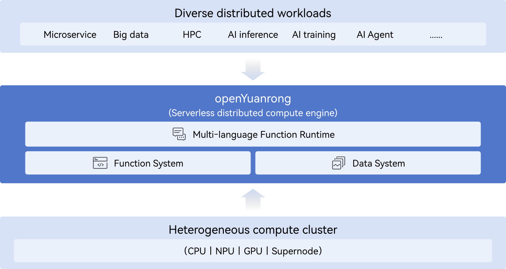

  

  
  
  

  English | [简体中文](README.md)

openYuanrong is a serverless distributed compute engine that unifies diverse workloads, from AI and big data to microservices, on a single, streamlined architecture. It provides multi-language function interfaces that simplify the development of complex distributed applications to feel just like writing a local program. Powered by dynamic scheduling and efficient data sharing, openYuanrong ensures high-performance execution and maximum cluster resource utilization.

## Overview

  

openYuanrong supports modular, on-demand usage of a multi-language function runtime, function system, and data system.

- **Multi-language Function Runtime**: Build powerful, distributed applications in Python, Java, and C++ as easily as you would write a program for a single machine.
- **Function System**: Maximize cluster resource utilization with dynamic scheduling, which seamlessly scales and migrates function instances across nodes.
- **Data System**: Accelerate data transfer between function instances using a multi-level distributed caching system that supports both object and stream semantics.

In openYuanrong, the function is a core abstraction that extends the serverless model. It behaves like a process in a single-machine OS, representing a running instance of a distributed application while offering native support for cross-function invocation.

openYuanrong consists of three code repositories:

- yuanrong: The multi-language function runtime (current repository).
- [yuanrong-functionsystem](https://atomgit.com/openeuler/yuanrong-functionsystem): Refers to the function system repository.
- [yuanrong-datasystem](https://atomgit.com/openeuler/yuanrong-datasystem): Refers to the data system repository.

## Getting Started

Check the [openYuanrong documentation](https://docs.openyuanrong.org/zh-cn/latest/index.html) to learn how to develop distributed applications with openYuanrong.

- Installation：`pip install https://openyuanrong.obs.cn-southwest-2.myhuaweicloud.com/release/0.7.0/linux/x86_64/openyuanrong-0.7.0-cp39-cp39-manylinux_2_34_x86_64.whl`，[More Details](https://docs.openyuanrong.org/zh-cn/latest/deploy/installation.html).
- [Quick Start Guide](https://docs.openyuanrong.org/zh-cn/latest/getting_started.html)

## Contributing

We welcome all forms of contributions to openYuanrong. Please refer to our [contributor guide](https://docs.openyuanrong.org/zh-cn/latest/contributor_guide/index.html).

## License

[Apache License 2.0](./LICENSE)
