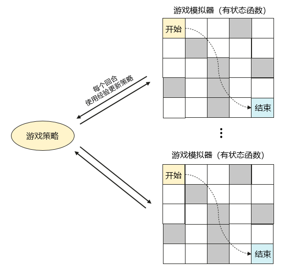

# 基于 openYuanrong 实现强化学习走迷宫

强化学习是机器学习里面的一个分支，机器通过观察环境并采取行动来与其交互，以取得最大化的预期收益。简而言之，就是让机器学着如何在环境中通过不断的试错、尝试，学习、累积经验拿到高奖励。

本示例将向您展示如何使用 openYuanrong 训练一个简单的策略来玩迷宫游戏，它包含以下内容：

- 如何使用有状态函数模拟迷宫游戏。
- 如何在多个有状态函数实例之间通过数据对象共享游戏策略。

## 方案介绍

我们使用多个 openYuanrong 有状态函数实例来模拟迷宫游戏并记录游戏经验，这些经验值用于更新游戏策略。更新后的策略在下个回合的模拟游戏中继续使用，不断循环优化。



## 准备工作

参考[在主机上部署](../../deploy/deploy_processes/index.md)完成 openYuanrong 部署。

## 实现流程

### 设置迷宫环境

我们用类 `Environment` 创建一个 5x5 的网格迷宫环境，起点为（0,0），终点为（4,4）。变量 `action_space` 定义在网格中可以执行的动作个数，即上下左右四个移动方向。在网格中，我们设定走到终点奖励 10 分，同时设置了一些陷阱稍微增加游戏的难度，如果玩家移动到陷阱位置，会受到扣除 10 分的惩罚。`step` 方法定义了如何在网格中移动，如果移动会越出边界，则判定移动后仍然在原来的位置。

```python
class Environment:
    def __init__(self):
        self.state, self.goal = (0, 0), (4, 4)

        self.action_space = 4 # 下（0），左（1），上（2），右（3）
        self.maze_space = (5, 5)
        self.maze = np.zeros((self.maze_space[0], self.maze_space[1]))

        # 走出迷宫奖励10分
        self.maze[self.goal] = 10

        # 走到陷阱，扣除5分
        self.maze[(0, 3)] = -10
        self.maze[(1, 1)] = -10
        self.maze[(2, 2)] = -10
        self.maze[(2, 4)] = -10
        self.maze[(3, 0)] = -10
        self.maze[(3, 2)] = -10
        self.maze[(4, 2)] = -10

    def reset(self):
        self.state = (0, 0)
        return self.get_state()

    def get_state(self):
        return (self.state[0], self.state[1])

    def get_reward(self):
        return self.maze[(self.state[0], self.state[1])]

    def is_done(self):
        return self.state == self.goal

    def step(self, action):
        if action == 0:  # 下
            self.state = (min(self.state[0] + 1, self.maze_space[0] - 1), self.state[1])
        elif action == 1:  # 左
            self.state = (self.state[0], max(self.state[1] - 1, 0))
        elif action == 2:  # 上
            self.state = (max(self.state[0] - 1, 0), self.state[1])
        elif action == 3:  # 右
            self.state = (self.state[0], min(self.state[1] + 1, self.maze_space[1] - 1))
        else:
            raise ValueError("Invalid action")

        return self.get_state(), self.get_reward(), self.is_done()
```

### 定义游戏策略

任何强化学习算法，都需要使用一种方法反复模拟以收集经验数据。这里，我们创建一个 `Policy` 策略类，用于决定如何在迷宫中行动。它的 `get_action` 方法接受当前玩家所在的状态并返回下一步动作，策略上通过创建一个“状态-动作-价值”表来选择最高价值动作，同时辅以随机动作探索其他可能。每个游戏回合，因为不同的动作会带来不同的奖励，通过记录这些数据，使用 `update` 方法不断更新我们的策略表，逼近不同动作能带来得最佳值，找到最优的行动路径。

```python
class Policy:
    def __init__(self, env):
        self.actions = np.arange(0, env.action_space)
        self.action_table = np.zeros((env.maze_space[0], env.maze_space[1], env.action_space))

    def get_action(self, state, epsilon=0.8):
        if random.uniform(0, 1) < epsilon:
            return np.random.choice(self.actions)  # 以一定概率随机选择动作
        return np.argmax(self.action_table[state[0], state[1], self.actions])

    def update(self, experiences, weight=0.1, discount_factor=0.9):
        # 使用回合经验更新策略并返回本次走过的路径用于展示
        route = []
        for state, action, reward, next_state in experiences:
            route.append(next_state)
            next_max = np.max(self.action_table[next_state])
            value = self.action_table[state][action]
            new_value = (1 - weight) * value + weight * (reward + discount_factor * next_max)
            self.action_table[state][action] = new_value

        return route
```

### 模拟游戏回合

我们创建一个 `Simulator` 类来模拟玩迷宫游戏，`rollout` 方法会返回每回合游戏积累的经验。类通过 `@yr.instance` 注解使该类的实例可以在openYuanrong集群的节点上分布式运行。

```python
@yr.instance
class Simulator(object):
    def __init__(self, env):
        self.env = env

    def rollout(self, policy, epsilon=0.8):
        # 玩一回合游戏，积累经验
        experiences = []
        state = self.env.reset()
        done = False
        while not done:
            action = policy.get_action(state, epsilon)
            next_state, reward, done = self.env.step(action)
            # 如果行动后状态没有变化就重走一次
            if next_state == state:
                continue
            experiences.append([state, action, reward, next_state])
            state = next_state
        return experiences
```

### 主流程

我们通过 `yr.init()` 初始化openYuanrong环境并创建两个模拟器实例 `simulators` 分布式并行运行，每个回合更新一次策略，快速迭代获取经验。您可以简单地通过修改 simulators_num 和 episodes_num 参数扩展到更大的集群的运行。

:::{tip}
我们指定了 Simulator 类实例运行所需的 cpu 和内存资源，在需要异构资源的场景中，您可以在部署集群的主从节点命令中增加 `--npu_collection_mode` 和 `--gpu_collection_enable` 参数，openYuanrong会自动采集节点上的异构资源信息。实际使用时，通过 `custom_resources` 参数指定对应资源。

```python
# 指定需要一张 3090 型号的 GPU 卡
opt.custom_resources = {"GPU/NVIDIA GeForce RTX 3090/count": 1}
# 指定需要一张任意型号的 NPU 卡
opt.custom_resources = {"NPU/.+/count": 1}
```

:::

```python
if __name__== "__main__" :
    # 初始化openYuanrong环境
    yr.init()

    # 创建两个模拟器，可根据openYuanrong集群大小调整
    simulators_num = 2
    # 每个模拟器玩500回合游戏
    episodes_num = 500

    env = Environment()
    policy = Policy(env)

    # 创建有状态函数Simulator类实例并设置其运行所需资源（1核CPU，1G内存）
    opt = yr.InvokeOptions(cpu=1000, memory=1024)
    simulators = [Simulator.options(opt).invoke(Environment()) for _ in range(simulators_num)]

    max_reward_route = float("-inf")
    for episode in range(episodes_num):
        policy_ref = yr.put(policy)
        experiences = [s.rollout.invoke(policy_ref) for s in simulators]

        # 等待所有结果返回
        while len(experiences) > 0:
            result = yr.wait(experiences)
            for xp in yr.get(result[0]):
                # 更新游戏策略，下个回合使用新策略
                route = policy.update(xp)
                # 计算当前回合的奖励，打印当前最高奖励回合的行动路径，用于观察算法收敛速度
                route_reward = sum(env.maze[state] for state in route)
                if max_reward_route < route_reward:
                    max_reward_route = route_reward
                    print(f"Episode {episode}, the optimal route is {route}, total reward {max_reward_route}")
            # 未返回的对象继续等待
            experiences = result[1]

    # 销毁实例，释放资源
    for s in simulators:
        s.terminate()
    yr.finalize()
```

### 运行程序

:::
:::{dropdown} 完整代码
:chevron: down-up
:icon: chevron-down

```python
import numpy as np
import random
import yr

class Environment:
    def __init__(self):
        self.state, self.goal = (0, 0), (4, 4)

        self.action_space = 4 # 下（0），左（1），上（2），右（3）
        self.maze_space = (5, 5)
        self.maze = np.zeros((self.maze_space[0], self.maze_space[1]))

        # 走出迷宫奖励10分
        self.maze[self.goal] = 10

        # 走到陷阱，扣除5分
        self.maze[(0, 3)] = -10
        self.maze[(1, 1)] = -10
        self.maze[(2, 2)] = -10
        self.maze[(2, 4)] = -10
        self.maze[(3, 0)] = -10
        self.maze[(3, 2)] = -10
        self.maze[(4, 2)] = -10

    def reset(self):
        self.state = (0, 0)
        return self.get_state()

    def get_state(self):
        return (self.state[0], self.state[1])

    def get_reward(self):
        return self.maze[(self.state[0], self.state[1])]

    def is_done(self):
        return self.state == self.goal

    def step(self, action):
        if action == 0:  # 下
            self.state = (min(self.state[0] + 1, self.maze_space[0] - 1), self.state[1])
        elif action == 1:  # 左
            self.state = (self.state[0], max(self.state[1] - 1, 0))
        elif action == 2:  # 上
            self.state = (max(self.state[0] - 1, 0), self.state[1])
        elif action == 3:  # 右
            self.state = (self.state[0], min(self.state[1] + 1, self.maze_space[1] - 1))
        else:
            raise ValueError("Invalid action")

        return self.get_state(), self.get_reward(), self.is_done()


class Policy:
    def __init__(self, env):
        self.actions = np.arange(0, env.action_space)
        self.action_table = np.zeros((env.maze_space[0], env.maze_space[1], env.action_space))

    def get_action(self, state, epsilon=0.8):
        if random.uniform(0, 1) < epsilon:
            return np.random.choice(self.actions)  # 以一定概率随机选择动作
        return np.argmax(self.action_table[state[0], state[1], self.actions])

    def update(self, experiences, weight=0.1, discount_factor=0.9):
        # 使用回合经验更新策略并返回本次走过的路径用于展示
        route = []
        for state, action, reward, next_state in experiences:
            route.append(next_state)
            next_max = np.max(self.action_table[next_state])
            value = self.action_table[state][action]
            new_value = (1 - weight) * value + weight * (reward + discount_factor * next_max)
            self.action_table[state][action] = new_value

        return route


@yr.instance
class Simulator(object):
    def __init__(self, env):
        self.env = env

    def rollout(self, policy, epsilon=0.8):
        # 玩一回合游戏，积累经验
        experiences = []
        state = self.env.reset()
        done = False
        while not done:
            action = policy.get_action(state, epsilon)
            next_state, reward, done = self.env.step(action)
            # 如果行动后状态没有变化就重走一次
            if next_state == state:
                continue
            experiences.append([state, action, reward, next_state])
            state = next_state
        return experiences


if __name__== "__main__" :
    # 初始化openYuanrong环境
    yr.init()

    # 创建两个模拟器，可根据openYuanrong集群大小调整
    simulators_num = 2
    # 每个模拟器玩500回合游戏
    episodes_num = 500

    env = Environment()
    policy = Policy(env)

    # 创建有状态函数Simulator类实例并设置其运行所需资源（1核CPU，1G内存）
    opt = yr.InvokeOptions(cpu=1000, memory=1024)
    simulators = [Simulator.options(opt).invoke(Environment()) for _ in range(simulators_num)]

    max_reward_route = float("-inf")
    for episode in range(episodes_num):
        policy_ref = yr.put(policy)
        experiences = [s.rollout.invoke(policy_ref) for s in simulators]

        # 等待所有结果返回
        while len(experiences) > 0:
            result = yr.wait(experiences)
            for xp in yr.get(result[0]):
                # 更新游戏策略，下个回合使用新策略
                route = policy.update(xp)
                # 计算当前回合的奖励，打印当前最高奖励回合的行动路径，用于观察算法收敛速度
                route_reward = sum(env.maze[state] for state in route)
                if max_reward_route < route_reward:
                    max_reward_route = route_reward
                    print(f"Episode {episode}, the optimal route is {route}, total reward {max_reward_route}")
            # 未返回的对象继续等待
            experiences = result[1]

    # 销毁实例，释放资源
    for s in simulators:
        s.terminate()
    yr.finalize()
```

:::

参考输出如下，路径中可能包含重复位置，您可以进一步优化算法比如把环境中的所有位置默认奖励设置为 -1。

```bash
Episode 0, the optimal route is [(1, 0), (0, 0), (1, 0), (1, 1), (1, 2), (2, 2), (2, 3), (2, 2), (3, 2), (3, 1), (3, 2), (4, 2), (3, 2), (4, 2), (4, 1), (4, 0), (4, 1), (3, 1), (4, 1), (3, 1), (2, 1), (3, 1), (3, 0), (4, 0), (3, 0), (4, 0), (4, 1), (4, 0), (4, 1), (3, 1), (3, 2), (3, 3), (2, 3), (3, 3), (4, 3), (4, 4)], total reward -100.0
Episode 1, the optimal route is [(1, 0), (0, 0), (1, 0), (0, 0), (0, 1), (1, 1), (1, 0), (1, 1), (1, 2), (0, 2), (1, 2), (1, 1), (1, 2), (1, 1), (2, 1), (3, 1), (4, 1), (4, 0), (4, 1), (4, 2), (4, 1), (4, 0), (4, 1), (3, 1), (4, 1), (4, 0), (4, 1), (4, 0), (4, 1), (4, 0), (4, 1), (4, 2), (4, 1), (4, 0), (4, 1), (4, 2), (4, 3), (4, 4)], total reward -60.0
Episode 2, the optimal route is [(1, 0), (1, 1), (1, 0), (0, 0), (0, 1), (1, 1), (2, 1), (3, 1), (3, 2), (3, 3), (2, 3), (3, 3), (3, 4), (4, 4)], total reward -20.0
Episode 3, the optimal route is [(0, 1), (0, 0), (1, 0), (2, 0), (2, 1), (3, 1), (2, 1), (2, 2), (2, 3), (1, 3), (2, 3), (2, 4), (1, 4), (1, 3), (2, 3), (3, 3), (3, 4), (4, 4)], total reward -10.0
Episode 7, the optimal route is [(0, 1), (0, 2), (0, 3), (0, 2), (1, 2), (0, 2), (1, 2), (0, 2), (1, 2), (1, 3), (2, 3), (3, 3), (4, 3), (3, 3), (3, 4), (3, 3), (3, 4), (3, 3), (3, 4), (4, 4)], total reward 0.0
Episode 29, the optimal route is [(0, 1), (0, 2), (1, 2), (1, 3), (1, 4), (0, 4), (1, 4), (1, 3), (2, 3), (3, 3), (3, 4), (4, 4)], total reward 10.0
```
