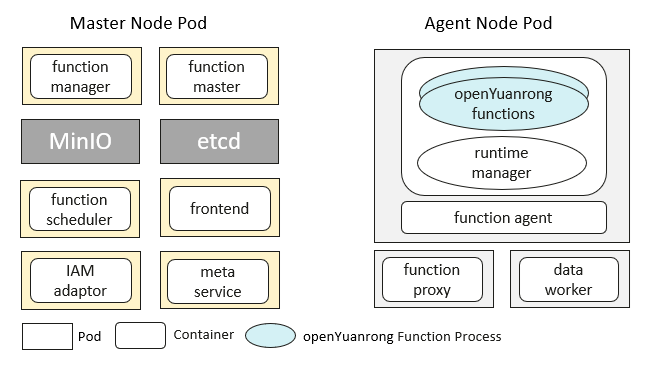

# Deploy openYuanrong Cluster on K8s

```{eval-rst}
.. toctree::
   :glob:
   :maxdepth: 1
   :hidden:

   production/index
   api/index
```

This section introduces how to deploy openYuanrong cluster on Kubernetes.

## Overview

openYuanrong cluster consists of master node pods and worker node pods.



For deployment, refer to [User Guide](production/index.md), which contains more content including configuration item introduction, security, cluster operations and maintenance, etc.

### Master Node Pod

Master node pod is used to manage the cluster, responsible for global function scheduling, request forwarding, etc. Components include function master, function manager, function scheduler, frontend, meta service, IAM adaptor, and open source MinIO, etcd.

### Worker Node Pod

Worker node pod is used to run distributed tasks. Deployed openYuanrong components include function agent, function proxy, data worker, and runtime manager.

### Component Introduction

- **function master**

  Responsible for topology management, global function scheduling, function instance lifecycle management, and scaling of function agent component. Deployment form is [Deployment](https://kubernetes.io/docs/concepts/workloads/controllers/deployment/){target="_blank"}, one master with multiple backups.
- **function manager**

  Responsible for lease application and recycling, cleaning up expired connection information. It is an openYuanrong system function.
- **function scheduler**

  Responsible for function service scheduling. It is an openYuanrong system function.
- **frontend**

  Provides REST API for calling services, subscribing to stream services and other data processing. It is an openYuanrong system function.
- **meta service**

  Provides REST API for management operations such as function creation, resource pool creation, etc. Deployment form is [Deployment](https://kubernetes.io/docs/concepts/workloads/controllers/deployment/){target="_blank"}.
- **IAM adaptor**

  Responsible for multi-tenant authentication and authorization. Deployment form is [Deployment](https://kubernetes.io/docs/concepts/workloads/controllers/deployment/){target="_blank"}, one master with multiple backups. If there are no related requirements or there is already an authentication platform, deployment is not required.
- **etcd**

  Third-party open source component used to store cluster component registration information, function metadata, and instance status information.
- **MinIO**

  Third-party open source component used to store function code packages uploaded by users, deployment is optional.
- **function proxy**

  Responsible for message forwarding, local function scheduling, and instance lifecycle management. Deployment form is [DaemonSet](https://kubernetes.io/docs/concepts/workloads/controllers/daemonset/){target="_blank"}.
- **function agent**

  Minimum resource unit, responsible for function code package download and decompression, network security isolation configuration, etc. Deployment form is [Deployment](https://kubernetes.io/docs/concepts/workloads/controllers/deployment/){target="_blank"}, it is in the same pod with runtime manager.
- **runtime manager**

  Responsible for cpu, memory and other resource collection and reporting, function process lifecycle management, etc. Deployment form is [Deployment](https://kubernetes.io/docs/concepts/workloads/controllers/deployment/){target="_blank"}, it is in the same pod with function agent.
- **data worker**

  Provides data object storage and other capabilities. Deployment form is [DaemonSet](https://kubernetes.io/docs/concepts/workloads/controllers/daemonset/){target="_blank"}.

### Pod Resource Pool

Pod resource pool is used to run function instances, theoretically based on K8s Deployment workload implementation, including function agent and function manager two container images. According to your actual business function needs, you can configure Pod resource pool's CPU, memory, replica count and other information during deployment, or dynamically create through [Resource Pool Management API](api/index.md) after deployment.
