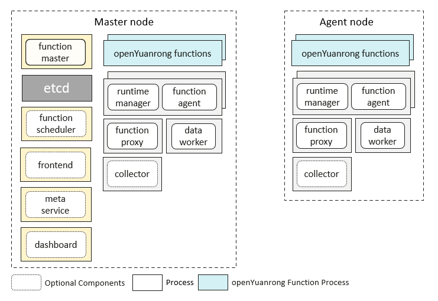

# Deploy openYuanrong Cluster on Hosts

```{eval-rst}
.. toctree::
   :glob:
   :maxdepth: 1
   :hidden:

   single-node-deployment
   production/index
   parameters
```

This section introduces how to deploy openYuanrong cluster on Linux hosts.

## Overview

openYuanrong cluster consists of master nodes and worker nodes. By default, only one master node is deployed. In high reliability scenarios, multiple master nodes can also be deployed in active-standby mode. Any number of worker nodes can be deployed, and they are managed by the master node. openYuanrong components and user functions run as processes on the nodes.



- For learning and development, refer to [Getting Started](single-node-deployment.md), use default configuration to deploy openYuanrong on one or more hosts.

- For production environment deployment, refer to [User Guide](production/index.md), which contains more content including configuration item introduction, security, cluster operations and maintenance, etc.

### Master Node

Master node is used to manage the cluster, responsible for global function scheduling, request forwarding, etc. In addition to the components on worker nodes, it also deploys function master, function scheduler, frontend, meta service, dashboard, and open source etcd.

### Worker Node

Worker node is used to run distributed tasks. Deployed openYuanrong components include function proxy, function agent, runtime manager, data worker, and collector.

### Component Introduction

- **function master**

  Responsible for topology management, global function scheduling, function instance lifecycle management, and scaling of function agent component.
- **function scheduler**

  Responsible for function service scheduling, deployment is not required when not using function service.
- **frontend**

  Provides REST API for calling services, subscribing to stream services and other data processing, deployment is not required when not using function service.
- **meta service**

  Provides REST API for management operations such as function creation, resource pool creation, etc., deployment is not required when not using function service.
- **dashboard**

  As an operations platform, provides capabilities to display cluster, node and other metrics, task status and logs. Can be deployed on demand, runtime depends on collector component.
- **etcd**

  Third-party open source component used to store cluster component registration information, function metadata, and instance status information.
- **function proxy**

  Responsible for message forwarding, local function scheduling, and instance lifecycle management.
- **function agent**

  Minimum resource unit, responsible for function code package download and decompression, network security isolation configuration, etc. Deployed in the same process with runtime manager.
- **runtime manager**

  Responsible for cpu, memory and other resource collection and reporting, function process lifecycle management, etc. Deployed in the same process with function agent.
- **data worker**

  Provides data object storage and other capabilities.
- **collector**

  Responsible for collecting metrics, logs and other data. Can be deployed on demand.
