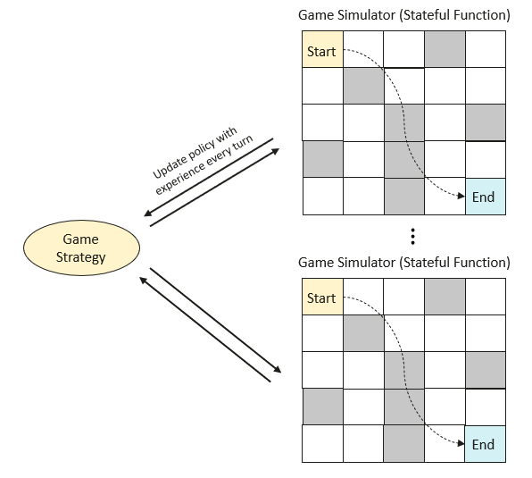

# Implementing Reinforcement Learning Maze Based on openYuanrong

Reinforcement learning is a branch of machine learning where machines interact with the environment by observing it and taking actions to maximize expected rewards. In short, it's about teaching machines how to learn and accumulate experience through continuous trial and error to achieve high rewards.

This example demonstrates how to use openYuanrong to train a simple policy to play a maze game, including:

- How to simulate a maze game using stateful functions.
- How to share game policies between multiple stateful function instances through data objects.

## Solution Overview

We use multiple openYuanrong stateful function instances to simulate the maze game and record game experiences. These experience values are used to update the game policy. The updated policy continues to be used in the next round of simulated games, continuously iterating and optimizing.



## Prerequisites

Refer to [Deploy on Hosts](../../deploy/deploy_processes/index.md) to complete openYuanrong deployment.

## Implementation Process

### Set Up Maze Environment

We use the class `Environment` to create a 5x5 grid maze environment, with the starting point at (0,0) and the endpoint at (4,4). The variable `action_space` defines the number of actions that can be executed in the grid, i.e., four movement directions: up, down, left, and right. In the grid, we set a reward of 10 points for reaching the endpoint, and also set some traps to slightly increase the game difficulty. If the player moves to a trap position, they will be penalized by deducting 10 points. The `step` method defines how to move in the grid. If the movement would go out of bounds, the position remains unchanged.

```python
class Environment:
    def __init__(self):
        self.state, self.goal = (0, 0), (4, 4)

        self.action_space = 4 # Down (0), Left (1), Up (2), Right (3)
        self.maze_space = (5, 5)
        self.maze = np.zeros((self.maze_space[0], self.maze_space[1]))

        # Reward 10 points for escaping the maze
        self.maze[self.goal] = 10

        # Penalty 5 points for falling into a trap
        self.maze[(0, 3)] = -10
        self.maze[(1, 1)] = -10
        self.maze[(2, 2)] = -10
        self.maze[(2, 4)] = -10
        self.maze[(3, 0)] = -10
        self.maze[(3, 2)] = -10
        self.maze[(4, 2)] = -10

    def reset(self):
        self.state = (0, 0)
        return self.get_state()

    def get_state(self):
        return (self.state[0], self.state[1])

    def get_reward(self):
        return self.maze[(self.state[0], self.state[1])]

    def is_done(self):
        return self.state == self.goal

    def step(self, action):
        if action == 0:  # Down
            self.state = (min(self.state[0] + 1, self.maze_space[0] - 1), self.state[1])
        elif action == 1:  # Left
            self.state = (self.state[0], max(self.state[1] - 1, 0))
        elif action == 2:  # Up
            self.state = (max(self.state[0] - 1, 0), self.state[1])
        elif action == 3:  # Right
            self.state = (self.state[0], min(self.state[1] + 1, self.maze_space[1] - 1))
        else:
            raise ValueError("Invalid action")

        return self.get_state(), self.get_reward(), self.is_done()
```

### Define Game Policy

Any reinforcement learning algorithm requires a method to repeatedly simulate to collect experience data. Here, we create a `Policy` class to decide how to navigate the maze. Its `get_action` method accepts the current player's state and returns the next action. The policy selects the highest value action by creating a "state-action-value" table, while also using random actions to explore other possibilities. Each game round, because different actions bring different rewards, by recording this data, the `update` method continuously updates our policy table, approaching the optimal values that different actions can bring, finding the optimal path.

```python
class Policy:
    def __init__(self, env):
        self.actions = np.arange(0, env.action_space)
        self.action_table = np.zeros((env.maze_space[0], env.maze_space[1], env.action_space))

    def get_action(self, state, epsilon=0.8):
        if random.uniform(0, 1) < epsilon:
            return np.random.choice(self.actions)  # Choose action randomly with certain probability
        return np.argmax(self.action_table[state[0], state[1], self.actions])

    def update(self, experiences, weight=0.1, discount_factor=0.9):
        # Update policy using round experience and return the path taken for display
        route = []
        for state, action, reward, next_state in experiences:
            route.append(next_state)
            next_max = np.max(self.action_table[next_state])
            value = self.action_table[state][action]
            new_value = (1 - weight) * value + weight * (reward + discount_factor * next_max)
            self.action_table[state][action] = new_value

        return route
```

### Simulate Game Rounds

We create a `Simulator` class to simulate playing the maze game. The `rollout` method returns the experience accumulated in each round. The class uses the `@yr.instance` annotation to enable instances of this class to run distributed on nodes in the openYuanrong cluster.

```python
@yr.instance
class Simulator(object):
    def __init__(self, env):
        self.env = env

    def rollout(self, policy, epsilon=0.8):
        # Play one round of game, accumulate experience
        experiences = []
        state = self.env.reset()
        done = False
        while not done:
            action = policy.get_action(state, epsilon)
            next_state, reward, done = self.env.step(action)
            # If state doesn't change after action, retry
            if next_state == state:
                continue
            experiences.append([state, action, reward, next_state])
            state = next_state
        return experiences
```

### Main Flow

We initialize the openYuanrong environment through `yr.init()` and create two simulator instances `simulators` to run distributed in parallel, updating the policy each round and rapidly iterating to acquire experience. You can easily scale to larger clusters by modifying the `simulators_num` and `episodes_num` parameters.

:::{tip}
We specified the CPU and memory resources required for the Simulator class instances. In scenarios requiring heterogeneous resources, you can add `--npu_collection_mode` and `--gpu_collection_enable` parameters to the master and worker node deployment commands, and openYuanrong will automatically collect heterogeneous resource information from nodes. In actual use, specify corresponding resources through the `custom_resources` parameter.

```python
# Specify one 3090 model GPU card
opt.custom_resources = {"GPU/NVIDIA GeForce RTX 3090/count": 1}
# Specify one NPU card of any model
opt.custom_resources = {"NPU/.+/count": 1}
```

:::

```python
if __name__== "__main__" :
    # Initialize openYuanrong environment
    yr.init()

    # Create two simulators, adjust according to openYuanrong cluster size
    simulators_num = 2
    # Each simulator plays 500 rounds
    episodes_num = 500

    env = Environment()
    policy = Policy(env)

    # Create stateful function Simulator class instances and set required resources (1 CPU core, 1G memory)
    opt = yr.InvokeOptions(cpu=1000, memory=1024)
    simulators = [Simulator.options(opt).invoke(Environment()) for _ in range(simulators_num)]

    max_reward_route = float("-inf")
    for episode in range(episodes_num):
        policy_ref = yr.put(policy)
        experiences = [s.rollout.invoke(policy_ref) for s in simulators]

        # Wait for all results to return
        while len(experiences) > 0:
            result = yr.wait(experiences)
            for xp in yr.get(result[0]):
                # Update game policy, use new policy in next round
                route = policy.update(xp)
                # Calculate current round reward, print action path of highest reward round for observing algorithm convergence speed
                route_reward = sum(env.maze[state] for state in route)
                if max_reward_route < route_reward:
                    max_reward_route = route_reward
                    print(f"Episode {episode}, the optimal route is {route}, total reward {max_reward_route}")
            # Objects not yet returned continue waiting
            experiences = result[1]

    # Destroy instances, release resources
    for s in simulators:
        s.terminate()
    yr.finalize()
```

### Run Program

:::
:::{dropdown} Complete Code
:chevron: down-up
:icon: chevron-down

```python
import numpy as np
import random
import yr

class Environment:
    def __init__(self):
        self.state, self.goal = (0, 0), (4, 4)

        self.action_space = 4 # Down (0), Left (1), Up (2), Right (3)
        self.maze_space = (5, 5)
        self.maze = np.zeros((self.maze_space[0], self.maze_space[1]))

        # Reward 10 points for escaping the maze
        self.maze[self.goal] = 10

        # Penalty 5 points for falling into a trap
        self.maze[(0, 3)] = -10
        self.maze[(1, 1)] = -10
        self.maze[(2, 2)] = -10
        self.maze[(2, 4)] = -10
        self.maze[(3, 0)] = -10
        self.maze[(3, 2)] = -10
        self.maze[(4, 2)] = -10

    def reset(self):
        self.state = (0, 0)
        return self.get_state()

    def get_state(self):
        return (self.state[0], self.state[1])

    def get_reward(self):
        return self.maze[(self.state[0], self.state[1])]

    def is_done(self):
        return self.state == self.goal

    def step(self, action):
        if action == 0:  # Down
            self.state = (min(self.state[0] + 1, self.maze_space[0] - 1), self.state[1])
        elif action == 1:  # Left
            self.state = (self.state[0], max(self.state[1] - 1, 0))
        elif action == 2:  # Up
            self.state = (max(self.state[0] - 1, 0), self.state[1])
        elif action == 3:  # Right
            self.state = (self.state[0], min(self.state[1] + 1, self.maze_space[1] - 1))
        else:
            raise ValueError("Invalid action")

        return self.get_state(), self.get_reward(), self.is_done()


class Policy:
    def __init__(self, env):
        self.actions = np.arange(0, env.action_space)
        self.action_table = np.zeros((env.maze_space[0], env.maze_space[1], env.action_space))

    def get_action(self, state, epsilon=0.8):
        if random.uniform(0, 1) < epsilon:
            return np.random.choice(self.actions)  # Choose action randomly with certain probability
        return np.argmax(self.action_table[state[0], state[1], self.actions])

    def update(self, experiences, weight=0.1, discount_factor=0.9):
        # Update policy using round experience and return the path taken for display
        route = []
        for state, action, reward, next_state in experiences:
            route.append(next_state)
            next_max = np.max(self.action_table[next_state])
            value = self.action_table[state][action]
            new_value = (1 - weight) * value + weight * (reward + discount_factor * next_max)
            self.action_table[state][action] = new_value

        return route


@yr.instance
class Simulator(object):
    def __init__(self, env):
        self.env = env

    def rollout(self, policy, epsilon=0.8):
        # Play one round of game, accumulate experience
        experiences = []
        state = self.env.reset()
        done = False
        while not done:
            action = policy.get_action(state, epsilon)
            next_state, reward, done = self.env.step(action)
            # If state doesn't change after action, retry
            if next_state == state:
                continue
            experiences.append([state, action, reward, next_state])
            state = next_state
        return experiences


if __name__== "__main__" :
    # Initialize openYuanrong environment
    yr.init()

    # Create two simulators, adjust according to openYuanrong cluster size
    simulators_num = 2
    # Each simulator plays 500 rounds
    episodes_num = 500

    env = Environment()
    policy = Policy(env)

    # Create stateful function Simulator class instances and set required resources (1 CPU core, 1G memory)
    opt = yr.InvokeOptions(cpu=1000, memory=1024)
    simulators = [Simulator.options(opt).invoke(Environment()) for _ in range(simulators_num)]

    max_reward_route = float("-inf")
    for episode in range(episodes_num):
        policy_ref = yr.put(policy)
        experiences = [s.rollout.invoke(policy_ref) for s in simulators]

        # Wait for all results to return
        while len(experiences) > 0:
            result = yr.wait(experiences)
            for xp in yr.get(result[0]):
                # Update game policy, use new policy in next round
                route = policy.update(xp)
                # Calculate current round reward, print action path of highest reward round for observing algorithm convergence speed
                route_reward = sum(env.maze[state] for state in route)
                if max_reward_route < route_reward:
                    max_reward_route = route_reward
                    print(f"Episode {episode}, the optimal route is {route}, total reward {max_reward_route}")
            # Objects not yet returned continue waiting
            experiences = result[1]

    # Destroy instances, release resources
    for s in simulators:
        s.terminate()
    yr.finalize()
```

:::

Reference output is as follows. The path may contain repeated positions. You can further optimize the algorithm, for example, by setting the default reward for all positions in the environment to -1.

```bash
Episode 0, the optimal route is [(1, 0), (0, 0), (1, 0), (1, 1), (1, 2), (2, 2), (2, 3), (2, 2), (3, 2), (3, 1), (3, 2), (4, 2), (3, 2), (4, 2), (4, 1), (4, 0), (4, 1), (3, 1), (4, 1), (3, 1), (2, 1), (3, 1), (3, 0), (4, 0), (3, 0), (4, 0), (4, 1), (4, 0), (4, 1), (3, 1), (3, 2), (3, 3), (2, 3), (3, 3), (4, 3), (4, 4)], total reward -100.0
Episode 1, the optimal route is [(1, 0), (0, 0), (1, 0), (0, 0), (0, 1), (1, 1), (1, 0), (1, 1), (1, 2), (0, 2), (1, 2), (1, 1), (1, 2), (1, 1), (2, 1), (3, 1), (4, 1), (4, 0), (4, 1), (4, 2), (4, 1), (4, 0), (4, 1), (3, 1), (4, 1), (4, 0), (4, 1), (4, 0), (4, 1), (4, 0), (4, 1), (4, 2), (4, 1), (4, 0), (4, 1), (4, 2), (4, 3), (4, 4)], total reward -60.0
Episode 2, the optimal route is [(1, 0), (1, 1), (1, 0), (0, 0), (0, 1), (1, 1), (2, 1), (3, 1), (3, 2), (3, 3), (2, 3), (3, 3), (3, 4), (4, 4)], total reward -20.0
Episode 3, the optimal route is [(0, 1), (0, 0), (1, 0), (2, 0), (2, 1), (3, 1), (2, 1), (2, 2), (2, 3), (1, 3), (2, 3), (2, 4), (1, 4), (1, 3), (2, 3), (3, 3), (3, 4), (4, 4)], total reward -10.0
Episode 7, the optimal route is [(0, 1), (0, 2), (0, 3), (0, 2), (1, 2), (0, 2), (1, 2), (0, 2), (1, 2), (1, 3), (2, 3), (3, 3), (4, 3), (3, 3), (3, 4), (3, 3), (3, 4), (3, 3), (3, 4), (4, 4)], total reward 0.0
Episode 29, the optimal route is [(0, 1), (0, 2), (1, 2), (1, 3), (1, 4), (0, 4), (1, 4), (1, 3), (2, 3), (3, 3), (3, 4), (4, 4)], total reward 10.0
```
