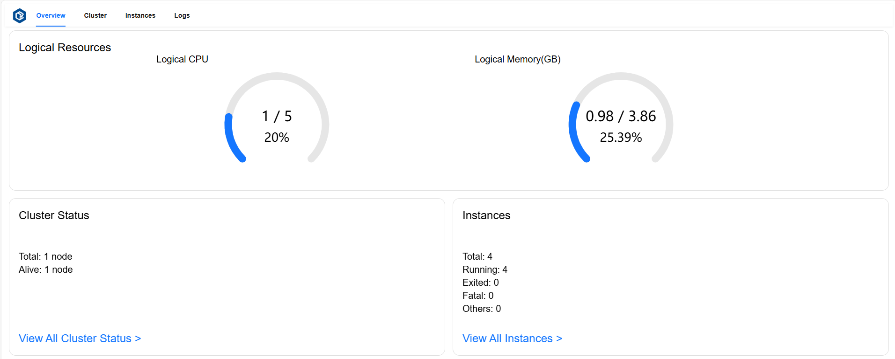
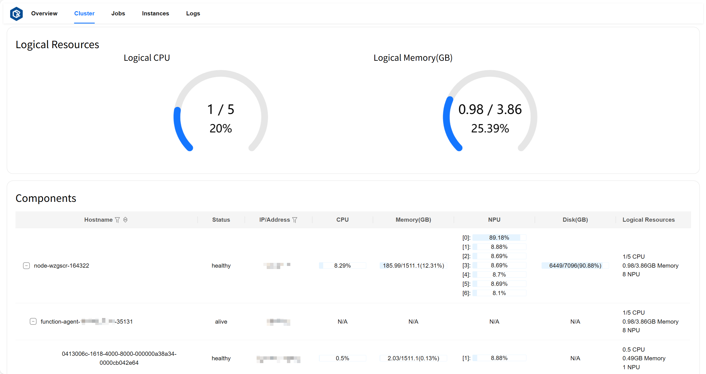
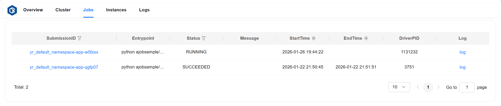
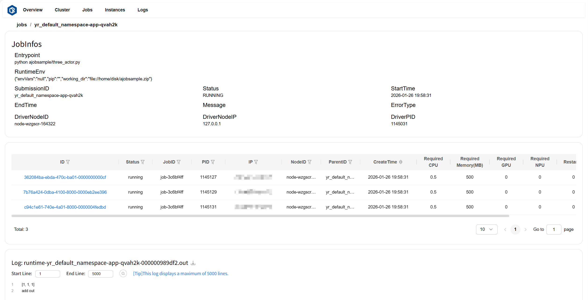
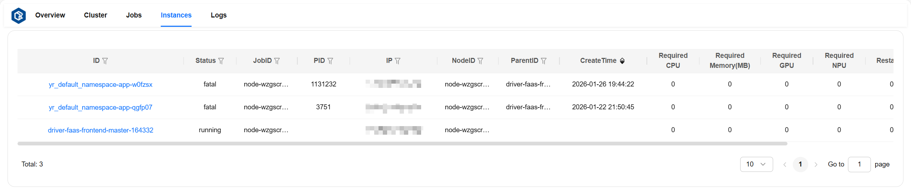
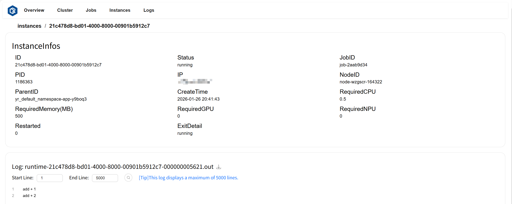
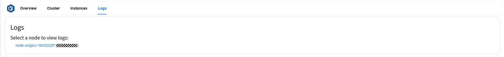
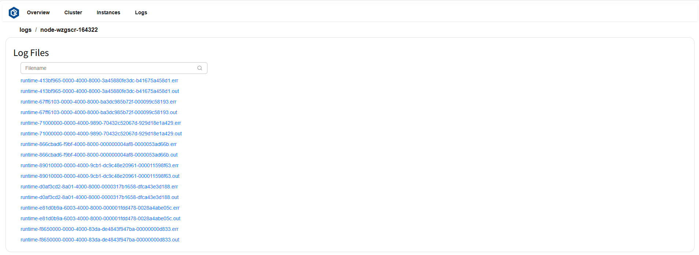
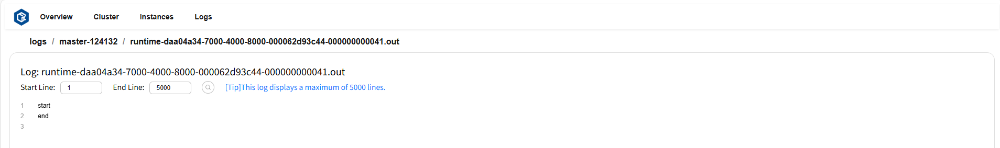

# Dashboard

openYuanrong provides a visual dashboard for viewing the status of clusters and function instances, facilitating monitoring and quick problem troubleshooting. Currently, the dashboard supports stable loading and display of over a thousand instances.

## Starting the Dashboard

To access the dashboard, you need to add the `--enable_dashboard=true` parameter and dependency parameters when deploying the openYuanrong cluster master node. The full deployment command for the master node using all dashboard features is as follows:

```bash
# Replace information in {} with actual values
yr start --master \
--enable_dashboard=true \
--enable_faas_frontend=true \
--enable_collector=true \
--enable_separated_redirect_runtime_std=true \
--prometheus_address={prometheus ip}:{prometheus port} \
--enable_metrics=true \
--metrics_config_file={absolute file path} \
--npu_collection_mode=all \
--port_policy=FIX
```

You can refer to the [Deployment Parameters Table](../deploy/deploy_processes/parameters.md) to trim unnecessary features.

- `enable_faas_frontend` parameter provides job information query functionality, affecting the display of job page content.
- `enable_collector` and `enable_separated_redirect_runtime_std` parameters provide function instance log collection functionality, affecting the display of log page content.
- `prometheus_address`, `enable_metrics`, `metrics_config_file`, and `npu_collection_mode` parameters provide metrics data collection functionality, affecting the display of CPU, Memory, NPU, and Disk items in the Cluster page table. To enable this feature, you need to deploy Prometheus service. Please refer to [Deploying Prometheus](observability-prometheus).
- `port_policy` parameter is used to fix the dashboard service port.

Successful deployment will print `local_ip` and `dashboard_port` information as follows:

```bash
Yuanrong deployed succeed
Cluster master info:
    local_ip:x.x.x.x,master_ip:x.x.x.x,etcd_ip:x.x.x.x,etcd_port:32379,global_scheduler_port:22770,ds_master_port:12123,etcd_peer_port:32380,bus-proxy:22772,bus:22773,ds-worker:31501,dashboard_port:9080,
```

Use `http://local_ip:dashboard_port` as the dashboard access URL (default URL is `http://localhost:9080`).

Deploying worker nodes does not require `enable_dashboard`, `enable_faas_frontend`, and `prometheus_address` parameters. Configure other parameters as needed, referring to the following command:

```bash
# Replace content in quotes with master node information printed in previous step, replace {} with actual values
yr start --enable_collector=true \
--enable_separated_redirect_runtime_std=true \
--enable_metrics=true \
--metrics_config_file={absolute file path} \
--npu_collection_mode=all \
--master_info "local_ip:x.x.x.x,master_ip:x.x.x.x,etcd_ip:x.x.x.x,etcd_port:32379,global_scheduler_port:22770,ds_master_port:12123,etcd_peer_port:32380,bus-proxy:22772,bus:22773,ds-worker:31501,dashboard_port:9080,"
```

## Page Introduction

The dashboard has multiple pages. View the corresponding page based on functionality:

* View total logical resource utilization: [Overview Page](observability-dashboard-overview), [Cluster Page](observability-dashboard-cluster)
* Overview all components and instance status: [Overview Page](observability-dashboard-overview)
* View status and logical resource utilization of all nodes and components: [Cluster Page](observability-dashboard-cluster)
* View progress and status of all jobs: [Jobs Page](observability-dashboard-jobs)
* View task progress and status of all instances: [Instances Page](observability-dashboard-instances)
* View and download instance logs and error information: [Logs Page](observability-dashboard-logs)

(observability-dashboard-overview)=

### Overview Page

The Overview page allows you to view total logical resource utilization and overview all components and instance status.

* Logical Resources card displays total Logical CPU cores used, total cores, and total utilization rate; total Logical Memory used (GB), total memory (GB), and total utilization rate.
* Cluster Status card displays total number of nodes and number of active nodes.
* Instances card displays total number of instances and number of instances in `running`, `exited`, and `fatal` states.

Page example:



(observability-dashboard-cluster)=

### Cluster Page

The Cluster page allows you to view total logical resource utilization, status of all nodes and components, resource metrics usage, and visualize the hierarchical relationship between nodes and components.

* Logical Resources card displays total Logical CPU cores used, total cores, and total utilization rate; total Logical Memory used (GB), total memory (GB), and total utilization rate.
* Components card displays node status, address, CPU and NPU utilization, Memory/Disk/Logical Resources metrics usage, total amount, and utilization rate; agent status running on corresponding nodes, address, Logical Resources metrics usage, total amount, and utilization rate; instance status running on corresponding agents, address, CPU and NPU utilization, Memory/Logical Resources metrics usage, total amount, and utilization rate.

Page example:



(observability-dashboard-jobs)=

### Jobs Page

The Jobs page allows you to view detailed information of all jobs.

Job detailed information description:

* entrypoint: Job entry command.
* runtimeEnv: Job runtime environment.
* submissionID: Submission ID when submitting the job.
* status: Job status (including: "PENDING", "RUNNING", "STOPPED", "SUCCEEDED", "FAILED").
* startTime: Job start time.
* endTime: Job end time.
* message: Detailed information describing job status.
* driverNodeID: ID of the node where the job runs.
* driverNodeIP: IP of the node where the job runs.
* driverPID: PID of the process running the job.

Page example:



Click `SubmissionID` or `log` to navigate to the job details page. The JobInfos card displays detailed information about the job, the instance list card displays instance information contained in the job, and the Log card displays logs and error information for the job.

Page example:



(observability-dashboard-instances)=

### Instances Page

The Instances page allows you to view detailed information of all instances.

Instance detailed information description:

* ID: Instance ID.
* status: Instance status.
* jobID: ID of the job corresponding to the instance.
* PID: PID of the process running the instance.
* IP: IP of the node where the instance runs.
* nodeID: ID of the node where the instance runs.
* parentID: Parent instance ID.
* createTime: Instance creation time.
* required CPU: Number of CPU cores required by the instance.
* required Memory: Memory required by the instance, in MB.
* required GPU: Number of GPU cores required by the instance.
* required NPU: Number of NPU cores required by the instance.
* restarted: Number of instance restarts.
* exitDetail: Detailed information when the instance exits.

Page example:



Click `ID` or `log` to navigate to the instance details page. The InstanceInfos card displays detailed information about the instance, and the Log card displays logs and error information for the instance.

Page example:



(observability-dashboard-logs)=

### Logs Page

The Logs page allows you to view and download all log content and error information. Page example:



Click on a selected node to view all log file lists under that node. Page example:



Click on the file you want to view to display the file content. Page example:



(observability-prometheus)=

## Deploying Prometheus

openYuanrong pushes data to Prometheus through Pushgateway. First, you need to deploy Pushgateway. [Download Pushgateway](https://github.com/prometheus/pushgateway/releases){target="_blank"} and refer to the following commands to complete the deployment.

```shell
tar -xzvf pushgateway-x.xx.x.linux-amd64.tar.gz # Replace tar package name with your downloaded filename
cd pushgateway-x.xx.x.linux-amd64
nohup ./pushgateway > ./pushgateway.log 2>&1 & # Pushgateway default port is 9091
```

### Configuring Prometheus

[Download Prometheus](https://prometheus.io/download/){target="_blank"} and extract.

```shell
tar -xzvf prometheus-x.x.x.linux-amd64.tar.gz # Replace tar package name with your downloaded filename
cd prometheus-x.x.x.linux-amd64
```

Modify the `prometheus.yml` file and add the following content in the `scrape_configs` configuration item, where `127.0.0.1` is replaced with the machine IP running Pushgateway.

```bash
- job_name: 'pushgateway'
  static_configs:
    - targets: ['127.0.0.1:9091'] 
```

### Starting Prometheus

```shell
nohup ./prometheus > ./prometheus.log 2>&1 & # Prometheus default port is 9090
```
