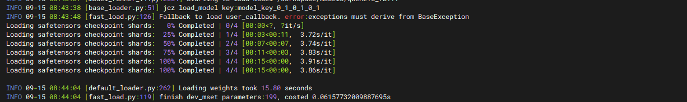

# Inference Instance Model Loading Speed 10x Improvement, Fast Elastic Response to Business Traffic Changes

When facing high loads or sudden traffic, the elastic speed of inference instances helps systems quickly adjust resources to prevent service interruptions or performance degradation, ensuring real-time performance and user experience. Faster elastic speed also allows systems to automatically adjust computing resources based on real-time load, expanding quickly during high load and releasing promptly during low load to avoid resource waste.

The elastic speed of inference instances is affected by many factors, such as task scheduling algorithms, quantity and performance of heterogeneous resources, inference model loading speed, etc. Among these, the model loading speed problem becomes more prominent as models grow larger. Based on the heterogeneous data object API provided by openYuanrong, one-time cold loading of models can be achieved, and model parameters can be shared through heterogeneous objects. When scaling up inference instances again, high-speed acquisition is possible.

## Solution Introduction

This case deploys and scales a Qwen inference instance on the Ascend environment based on the vLLM inference framework. The following steps introduce how to use the openYuanrong heterogeneous data object API:

- Deploy openYuanrong in the [vLLM Ascend](https://docs.vllm.ai/projects/ascend/en/latest/index.html){target="_blank"} container mirror environment based on openEuler.
- Provide vLLM patches to adapt the openYuanrong heterogeneous data object API.
- Use openYuanrong to deploy and scale a Qwen inference instance based on vLLM, testing acceleration effects.

## Preparation

Prepare an Ascend host (with at least two available NPU cards) and create the directory `/workspace/models` on the host to store model files, and create the directory `/workspace/tools` to store other dependencies.

1. Install docker on the host and pull the `quay.io/ascend/vllm-ascend:v0.10.0rc1-openeuler` image from the [quay.io image repository](https://quay.io/repository/ascend/vllm-ascend?tab=tags&tag=latest){target="_blank"}. The image contains vLLM and vLLM Ascend v0.10.0rc1 versions.

2. Download Qwen2.5-7B-Instruct model files to the host, stored in the `/workspace/models/qwen2.5_7B` directory.

3. Download the [model deployment script](https://atomgit.com/openeuler/yuanrong/tree/master/docs/sample_code/llm_on_multiple_machines){target="_blank"} developed using openYuanrong (including all files in the directory), stored in the `/workspace/tools/deploy` directory.

4. Download the [vLLM Ascend patch](https://atomgit.com/openeuler/yuanrong-datasystem/blob/master/tests/kvconnector/patch/v0.10.0rc1/0001-implement-yr-datasystem-connector-and-support-multimoda.patch){target="_blank"}, stored in the `/workspace/tools/patch` directory.

5. Create the vLLM patch file `vllm.patch` in the `/workspace/tools` directory with the following content:

    ```diff
    diff --git a/kernel_meta/buildPidInfo.json b/kernel_meta/buildPidInfo.json
    new file mode 100644
    index 0000000..c4ca3fd
    --- /dev/null
    +++ b/kernel_meta/buildPidInfo.json
    @@ -0,0 +1,6 @@
    +[
    +    [
    +        57487,
    +        "/vllm-workspace/vllm/kernel_meta/kernel_meta_11984694443134222033"
    +    ]
    +]
    \ No newline at end of file
    diff --git a/vllm/model_executor/model_loader/base_loader.py b/vllm/model_executor/model_loader/base_loader.py
    index 4cf6c79..9038a27 100644
    --- a/vllm/model_executor/model_loader/base_loader.py
    +++ b/vllm/model_executor/model_loader/base_loader.py
    @@ -45,7 +45,12 @@ class BaseModelLoader(ABC):
                                              model_config=model_config)

                 logger.debug("Loading weights on %s ...", load_device)
    +            from vllm.model_executor.model_loader.fast_load import fast_load_weights, get_model_key
                 # Quantization does not happen in `load_weights` but after it
    -            self.load_weights(model, model_config)
    +            model_key = get_model_key("model_key")
    +            logger.info(f"load_model key:{model_key}")
    +            fast_load_weights(model, model_key, self.load_weights, model_config)
    +            # self.load_weights(model, model_config)
    +
                 process_weights_after_loading(model, model_config, target_device)
             return model.eval()
    diff --git a/vllm/model_executor/model_loader/fast_load.py b/vllm/model_executor/model_loader/fast_load.py
    new file mode 100644
    index 0000000..6a26ba1
    --- /dev/null
    +++ b/vllm/model_executor/model_loader/fast_load.py
    @@ -0,0 +1,128 @@
    +import time
    +import os
    +import torch
    +
    +from yr.datasystem.hetero_client import HeteroClient, Blob, DeviceBlobList
    +from yr.datasystem.ds_tensor_client import DsTensorClient
    +from torch_npu.npu import current_device
    +from vllm.distributed.parallel_state import (
    +    get_tp_group, get_ep_group, get_pp_group
    +)
    +
    +from vllm.logger import logger
    +from collections import OrderedDict
    +
    +_global_tensor_client = None
    +_global_hetero_client = None
    +_DEV_MGET_TIMEOUT_MS = 10 * 1000
    +CHUNK_SIZE = 100
    +
    +def get_model_key(model_id: str):
    +    tp_world_size = get_tp_group().world_size
    +    pp_world_size = get_pp_group().world_size
    +    tp_rank = get_tp_group().rank
    +    pp_rank = get_pp_group().rank
    +    ep_world_size = get_ep_group().world_size
    +    ep_rank = get_ep_group().rank
    +    key = model_id + f"_{tp_rank}_{tp_world_size}_{pp_rank}_{pp_world_size}"
    +    key += f"_{ep_rank}_{ep_world_size}"
    +    return key
    +
    +
    +def get_tensor_client():
    +    global _global_tensor_client
    +
    +    if _global_tensor_client:
    +        return _global_tensor_client
    +
    +    ds_worker_addr = _inspect_data_system_address()
    +    if ds_worker_addr.find(":") == -1:
    +        raise ValueError(
    +            "Invalid address of data system worker: {}, expect 'ip:port'".format(ds_worker_addr))
    +    host, port = ds_worker_addr.split(":")
    +    port = int(port)
    +    _global_tensor_client = DsTensorClient(host, port, current_device())
    +    _global_tensor_client.init()
    +
    +    return _global_tensor_client
    +
    +
    +def get_hetero_client():
    +    """
    +    Create ds hetero client if not initialized, otherwise returns the previously created one.
    +
    +    :return: HeteroClient
    +    """
    +    global _global_hetero_client
    +
    +    if _global_hetero_client:
    +        return _global_hetero_client
    +
    +    ds_worker_addr = _inspect_data_system_address()
    +    if ds_worker_addr.find(":") == -1:
    +        raise ValueError(
    +            "Invalid address of data system worker: {}, expect 'ip:port'".format(ds_worker_addr))
    +    host, port = ds_worker_addr.split(":")
    +    port = int(port)
    +    _global_hetero_client = HeteroClient(host, port)
    +    _global_hetero_client.init()
    +
    +    return _global_hetero_client
    +
    +
    +def _inspect_data_system_address():
    +    for address in [
    +        # yr.config_manager.ConfigManager().ds_address,
    +        os.getenv("DS_WORKER_ADDR"),
    +    ]:
    +        if address and len(address) != 0:
    +            return address
    +    raise RuntimeError("cannot inspect data system address")
    +
    +
    +def _load_from_ds(model, key: str):
    +    start_time = time.time()
    +    tensor_client = get_tensor_client()
    +    tensor_list = []
    +    num_load_success_param = 0
    +    named_tensors = OrderedDict()
    +    for name, param in model.named_parameters():
    +        named_tensors[name] = param.data
    +    for name, param in named_tensors.items():
    +        tensor_list.append(param)
    +    key_list = [key + f"index_{index}" for index in range(len(tensor_list))]
    +    try:
    +        tensor_client.dev_mget(key_list, tensor_list, _DEV_MGET_TIMEOUT_MS)
    +        num_load_success_param += len(tensor_list)
    +    except Exception as e:
    +        raise RuntimeError(f"dev_mget failed, error: {e}")
    +
    +    logger.info(f"Loaded {num_load_success_param} parameters from datasystem, costed {time.time() - start_time}s")
    +    return num_load_success_param
    +
    +
    +def _publish_to_ds(model, key: str):
    +    start_time = time.time()
    +    tensor_client = get_tensor_client()
    +    tensor_list = []
    +    named_tensors = OrderedDict()
    +    for name, param in model.named_parameters():
    +        named_tensors[name] = param.data
    +    for name, param in named_tensors.items():
    +        tensor_list.append(param)
    +    key_list = [key + f"index_{index}" for index in range(len(tensor_list))]
    +    try:
    +        tensor_client.dev_mset(key_list, tensor_list)
    +    except Exception as e:
    +        logger.error(f"dev_mset failed, error: {e}")
    +
    +    logger.info(f"finish dev_mset parameters:{len(tensor_list)}, costed {time.time() - start_time}s")
    +
    +
    +def fast_load_weights(model, key: str, load_callback, model_config):
    +    try:
    +        _load_from_ds(model, key)
    +    except Exception as e:
    +        logger.info(f"Fallback to load user_callback. error:{e}")
    +        load_callback(model, model_config)
    +        _publish_to_ds(model, key)
    \ No newline at end of file
    ```

    The patch adapts the model fast loading capability provided by openYuanrong in the `/vllm/model_executor/model_loader/base_loader.py` file. When the first inference instance loads the model, there is no model metadata information in the openYuanrong data system, so the `fast_load_weights()` function will use the default method (local) to load the model and publish metadata to the openYuanrong data system. When pulling up the same inference instance again, because the same metadata information is queried in the openYuanrong data system, the model will quickly synchronize from the deployed inference instance's video memory.

    Actually, the core logic of the patch code is calling the `dev_mset()` and `dev_mget()` interfaces of the openYuanrong data system. You can easily use these interfaces to implement the same capabilities in other inference frameworks.

## Deploy openYuanrong in Container

Refer to the following commands to run the container. For details on startup parameter configuration, see the [vLLM Ascend documentation](https://docs.vllm.ai/projects/ascend/en/latest/index.html){target="_blank"}:

```bash
# Please customize docker_name, and configure device according to the actual host NPU card situation
docker run \
--name "docker_name" \
--privileged \
-itu root \
-d --shm-size 64g \
--net=host \
--device=/dev/davinci0:/dev/davinci0 \
--device=/dev/davinci1:/dev/davinci1 \
--device=/dev/davinci2:/dev/davinci2 \
--device=/dev/davinci3:/dev/davinci3 \
--device=/dev/davinci4:/dev/davinci4 \
--device=/dev/davinci5:/dev/davinci5 \
--device=/dev/davinci6:/dev/davinci6 \
--device=/dev/davinci7:/dev/davinci7 \
--device=/dev/davinci_manager:/dev/davinci_manager \
--device=/dev/devmm_svm:/dev/devmm_svm \
--device=/dev/hisi_hdc:/dev/hisi_hdc \
-v /usr/local/dcmi:/usr/local/dcmi \
-v /usr/local/bin/npu-smi:/usr/local/bin/npu-smi \
-v /usr/local/Ascend/driver/lib64/:/usr/local/Ascend/driver/lib64/ \
-v /usr/local/Ascend/driver/version.info:/usr/local/Ascend/driver/version.info \
-v /usr/bin/hccn_tool:/usr/bin/hccn_tool \
-v /etc/ascend_install.info:/etc/ascend_install.info \
-v /root/.cache:/root/.cache \
-v /workspace:/workspace \
-it quay.io/ascend/vllm-ascend:v0.10.0rc1-openeuler bash
```

:::{Note}

The following operations are all performed in the container.

:::

1. Patch vLLM

    ```bash
    cd /vllm-workspace/vllm
    git apply /workspace/tools/vllm.patch
    ```

2. Patch vLLM Ascend

   :::{Note}

   First configure your git username and email (check if configured via git config --list). As follows:

   git config --global user.name "your name"
   git config --global user.email "email@your_email"

   :::

   ```bash
   cd /vllm-workspace/vllm-ascend
   git am /workspace/tools/patch/0001-implement-yr-datasystem-connector-and-support-multimoda.patch
   python setup.py develop
   ```

3. Install openYuanrong

   On Linux x86_64 environment:
   
   ```bash
   pip install https://openyuanrong.obs.cn-southwest-2.myhuaweicloud.com/release/0.7.0/linux/x86_64/openyuanrong-0.7.0-cp311-cp311-manylinux_2_34_x86_64.whl

   # Install data system SDK
   pip install https://openyuanrong.obs.cn-southwest-2.myhuaweicloud.com/release/0.7.0/linux/x86_64/openyuanrong_datasystem-0.7.0-cp311-cp311-manylinux_2_34_x86_64.whl
   ```
   
   On Linux aarch64 (ARM) environment:

   ```bash
   pip install https://openyuanrong.obs.cn-southwest-2.myhuaweicloud.com/release/0.7.0/linux/aarch64/openyuanrong-0.7.0-cp311-cp311-manylinux_2_34_aarch64.whl

   # Install data system SDK
   pip install https://openyuanrong.obs.cn-southwest-2.myhuaweicloud.com/release/0.7.0/linux/aarch64/openyuanrong_datasystem-0.7.0-cp311-cp311-manylinux_2_34_aarch64.whl
   ```

4. Deploy openYuanrong

   Execute the following command to deploy:

   ```bash
   # Replace MASTER_IP with your current host IP, choose any idle port to configure etcd port and peer_port
   yr start --master -v \
     -s 'values.etcd.address=[{ip="'${MASTER_IP}'",port=22440,peer_port=22441}]' \
     -s 'function_agent.args.runtime_direct_connection_enable=true' \
     -s 'function_agent.args.enable_separated_redirect_runtime_std=true'
   ```

   Record the `ds_master_port` port in the command output `Cluster master info:`, for example 11373. Configure the environment variable `export DS_WORKER_ADDR=${MASTER_IP}:11373` for connecting to the data system when deploying inference instances.

   Check deployment status, showing agent count is 1:

   ```bash
   yr status

   # ...
   # YuanRong cluster status:
   #    current running agents: 1
   ```

## Deploy the First Qwen Inference Instance

Configure the following environment variables separately in the container:

```bash
# Inference service IP and port, can be customized
export SERVER_IP=127.0.0.1
export SERVER_PORT=9000

# Model file path
export MODEL_PATH="/workspace/models/qwen2.5_7B"
# Add the directory where openYuanrong model deployment script is located to Python module search path
export PYTHONPATH=$PYTHONPATH:/workspace/tools/deploy

# Enable vLLM's v1 API mode
export VLLM_USE_V1=1
# Python multiprocessing start method is spawn
export VLLM_WORKER_MULTIPROC_METHOD=spawn
# Video memory capacity required for model execution on a single card, 20 is just right for Qwen2.5-7B
export vLLM_MODEL_MEMORY_USE_GB=20
export PROTOCOL_BUFFERS_PYTHON_IMPLEMENTATION=python

# Replace YR_INSTALL_PATH with openYuanrong installation path
# Can use python -c "import yr; print(yr.__path__[0])" to view, take inner directory
# For example: /usr/local/Python-3.11.9/lib/python3.11/site-packages/yr
export LD_LIBRARY_PATH=${YR_INSTALL_PATH}/functionsystem/lib:$LD_LIBRARY_PATH
export HCL_OP_EXPANSION_MODE="AIV"
# Whether to enable openYuanrong multi-level cache prefix matching capability, value 1 means enable
export USING_PREFIX_CONNECTOR=1

# Deploy PD merged inference instance
export PREFILL_INS_NUM=1
export DECODE_INS_NUM=0
export PTP=2
export DTP=0
export PDP=1
export DDP=0
```

In the container where openYuanrong node is located, run the following script in the `/workspace/tools/deploy` directory to deploy:

```bash
# Clean environment after deployment failure or completion via bash run_vllm_on_yr.sh clean
bash run_vllm_on_yr.sh deploy

# View deployment logs
tail -f deploy.log

# Success will output the following information
# [2025-10-21 03:10:47.616 INFO init apis.py:168 281472883448096] Succeeded to init YR, jobID is job-6dc821f8
# [2025-10-21 03:10:47.665 INFO _invoke instance_proxy.py:256 281472883448096] [Reference Counting] put code with id = ca1e22047396342d9ea3;7a72051c-e04b-429f-ac50-db6a428bfb0b, className = Controller
# INFO:     Started server process [921319]
# INFO:     Waiting for application startup.
# INFO:     Application startup complete.
# INFO:     Uvicorn running on http://127.0.0.1:9000 (Press CTRL+C to quit)
```

View the inference instance runtime log file `runtime-{runtime_id}.out` in the `/tmp/yr_sessions/latest/log/` directory. Expected output shows model loading takes about 15.8 seconds.



## Scale Up a Qwen Inference Instance

Execute the following command in the container to scale up the same inference instance:

```bash
# Replace SERVER_IP and SERVER_PORT with your own node host IP and port (configured in the case above)
curl --location --request POST 'http://${SERVER_IP}:${SERVER_PORT}/scaleout'
```

View the newly scaled-up inference instance runtime log file `runtime-{runtime_id}.out` in the `/tmp/yr_sessions/latest/log/` directory. Expected output shows model loading takes about 1.5 seconds, a 10x acceleration performance improvement.


