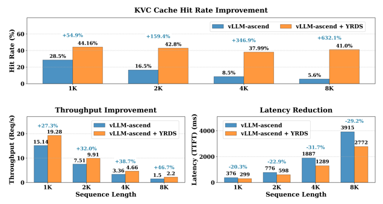

# Deploy Multi-Machine PD Separation Service Based on vLLM, Long Sequence Inference TTFT Reduced by 20%

Long sequence reasoning enables large language models to truly understand and handle complex problems. For example, chatbots need to maintain coherence in multi-turn conversations to provide more humanized services. However, as input sequences increase, inference services also face significant challenges:

1. Computational complexity increases dramatically: Computational complexity is proportional to the square of the sequence length. A common optimization approach is to use a PD (Prefill-Decode) separated inference architecture, deploying Prefill and Decode instances on multiple machines, but the cross-machine KV Cache transfer problem needs to be handled well.
2. Video memory bottleneck: KV Cache occupies a large amount of video memory, limiting the maximum context length that the model can handle.

openYuanrong provides distributed multi-level caching (HBM/DRAM/SSD) and high-performance D2D (device to device)/H2D (host to device)/D2H (device to host) access capabilities, which can significantly reduce long sequence inference TTFT (time to first token) latency and improve inference service throughput:

1. PD separated inference instances deployed on multiple machines can accelerate KV Cache cross-machine transfer from Prefill to Decode instances through the openYuanrong data system.
2. When video memory is insufficient, overflow data can be cached to the openYuanrong data system, improving KV Cache hit rate and reducing redundant computation.

## Solution Introduction

This case deploys a PD-separated Qwen inference service based on the vLLM inference framework. The following steps introduce how to use openYuanrong's heterogeneous distributed multi-level caching capabilities:

- Deploy openYuanrong in the [vLLM Ascend](https://docs.vllm.ai/projects/ascend/en/latest/index.html){target="_blank"} container mirror environment based on openEuler.
- Patch vLLM Ascend to adapt openYuanrong's distributed multi-machine caching capabilities.
- Deploy PD-separated Qwen inference service in containers across hosts, testing long sequence inference effects.

## Preparation

Prepare two Ascend hosts (each with at least one available NPU card) and create the directory `/workspace/models` on the hosts to store model files, and create the directory `/workspace/tools` to store other dependencies.

1. Install docker on the hosts and pull the `quay.io/ascend/vllm-ascend:v0.10.0rc1-openeuler` image from the [quay.io image repository](https://quay.io/repository/ascend/vllm-ascend?tab=tags&tag=latest){target="_blank"}. The image contains vLLM and vLLM Ascend v0.10.0rc1 versions.

2. Download Qwen2.5-7B-Instruct model files to the hosts, stored in the `/workspace/models/qwen2.5_7B` directory.

3. Download the [model deployment script](https://atomgit.com/openeuler/yuanrong/tree/master/docs/sample_code/llm_on_multiple_machines){target="_blank"} developed using openYuanrong (including all files in the directory), stored in the `/workspace/tools/deploy` directory.

4. Download the [vLLM Ascend patch](https://atomgit.com/openeuler/yuanrong-datasystem/blob/master/tests/kvconnector/patch/v0.10.0rc1/0001-implement-yr-datasystem-connector-and-support-multimoda.patch){target="_blank"}, stored in the `/workspace/tools/patch` directory.

## Deploy openYuanrong in Container

Use the following commands on both hosts to run containers respectively. For details on startup parameter configuration, see the [vLLM Ascend documentation](https://docs.vllm.ai/projects/ascend/en/latest/index.html){target="_blank"}:

```bash
# Please customize docker_name, and configure device according to the actual host NPU card situation
docker run \
--name "docker_name" \
--privileged \
-itu root \
-d --shm-size 64g \
--net=host \
--device=/dev/davinci0:/dev/davinci0 \
--device=/dev/davinci1:/dev/davinci1 \
--device=/dev/davinci2:/dev/davinci2 \
--device=/dev/davinci3:/dev/davinci3 \
--device=/dev/davinci4:/dev/davinci4 \
--device=/dev/davinci5:/dev/davinci5 \
--device=/dev/davinci6:/dev/davinci6 \
--device=/dev/davinci7:/dev/davinci7 \
--device=/dev/davinci_manager:/dev/davinci_manager \
--device=/dev/devmm_svm:/dev/devmm_svm \
--device=/dev/hisi_hdc:/dev/hisi_hdc \
-v /usr/local/dcmi:/usr/local/dcmi \
-v /usr/local/bin/npu-smi:/usr/local/bin/npu-smi \
-v /usr/local/Ascend/driver/lib64/:/usr/local/Ascend/driver/lib64/ \
-v /usr/local/Ascend/driver/version.info:/usr/local/Ascend/driver/version.info \
-v /usr/bin/hccn_tool:/usr/bin/hccn_tool \
-v /etc/ascend_install.info:/etc/ascend_install.info \
-v /root/.cache:/root/.cache \
-v /workspace:/workspace \
-it quay.io/ascend/vllm-ascend:v0.10.0rc1-openeuler bash
```

:::{Note}

The following operations are all performed in the container.

:::

1. Patch vLLM Ascend

   :::{Note}

   First configure your git username and email (check if configured via git config --list). As follows:

   git config --global user.name "your name"
   git config --global user.email "email@your_email"

   :::

   ```bash
   cd /vllm-workspace/vllm-ascend
   git am /workspace/tools/patch/0001-implement-yr-datasystem-connector-and-support-multimoda.patch
   python setup.py develop
   ```

2. Install openYuanrong

   On Linux x86_64 environment:
   
   ```bash
   pip install https://openyuanrong.obs.cn-southwest-2.myhuaweicloud.com/release/0.7.0/linux/x86_64/openyuanrong-0.7.0-cp311-cp311-manylinux_2_34_x86_64.whl

   # Install data system SDK
   pip install https://openyuanrong.obs.cn-southwest-2.myhuaweicloud.com/release/0.7.0/linux/x86_64/openyuanrong_datasystem-0.7.0-cp311-cp311-manylinux_2_34_x86_64.whl
   ```
   
   On Linux aarch64 (ARM) environment:

   ```bash
   pip install https://openyuanrong.obs.cn-southwest-2.myhuaweicloud.com/release/0.7.0/linux/aarch64/openyuanrong-0.7.0-cp311-cp311-manylinux_2_34_aarch64.whl

   # Install data system SDK
   pip install https://openyuanrong.obs.cn-southwest-2.myhuaweicloud.com/release/0.7.0/linux/aarch64/openyuanrong_datasystem-0.7.0-cp311-cp311-manylinux_2_34_aarch64.whl
   ```

3. Deploy openYuanrong

   Choose one host as the master node and execute the following command to deploy:

   ```bash
   # Replace MASTER_IP with your current host IP, choose any idle port to configure etcd port and peer_port
   yr start --master -v \
     -s 'values.etcd.address=[{ip="'${MASTER_IP}'",port=22440,peer_port=22441}]' \
     -s 'function_agent.args.runtime_direct_connection_enable=true' \
     -s 'function_agent.args.enable_separated_redirect_runtime_std=true'
   ```

   Record the function_master port (such as default 22770) in the master node startup output. The other host as a worker node executes the following command to deploy:

   ```bash
   # Replace MASTER_IP with master node IP, FUNCTION_MASTER_PORT with the function_master port in the master node startup output
   yr start -v \
     --master_address http://${MASTER_IP}:${FUNCTION_MASTER_PORT} \
     -s 'function_agent.args.runtime_direct_connection_enable=true' \
     -s 'function_agent.args.enable_separated_redirect_runtime_std=true'
   ```

   Check deployment status, showing agent count is 2:

   ```bash
   yr status

   # ...
   # YuanRong cluster status:
   #    current running agents: 2
   ```

## Deploy Qwen PD Separated Inference Instance Using Script

Configure the following environment variables separately in the containers where openYuanrong master and worker nodes are located, and keep the configuration consistent:

```bash
# Inference service IP and port, can be customized
export SERVER_IP=xx.xx.xx.xx # Replace with your own master/worker node IP here
export SERVER_PORT=9000

# Model file path
export MODEL_PATH="/workspace/models/qwen2.5_7B"
# Add the directory where openYuanrong model deployment script is located to Python module search path
export PYTHONPATH=$PYTHONPATH:/workspace/tools/deploy

# Enable vLLM's v1 API mode
export VLLM_USE_V1=1
# Python multiprocessing start method is spawn
export VLLM_WORKER_MULTIPROC_METHOD=spawn
# Video memory capacity required for model execution on a single card, 20 is just right for Qwen2.5-7B
export vLLM_MODEL_MEMORY_USE_GB=20
export PROTOCOL_BUFFERS_PYTHON_IMPLEMENTATION=python

# Replace YR_INSTALL_PATH with openYuanrong installation path
# Can use python -c "import yr; print(yr.__path__[0])" to view, take inner directory
# For example: /usr/local/Python-3.11.9/lib/python3.11/site-packages/yr
export LD_LIBRARY_PATH=${YR_INSTALL_PATH}/functionsystem/lib:$LD_LIBRARY_PATH
export HCL_OP_EXPANSION_MODE="AIV"
# Whether to enable openYuanrong multi-level cache prefix matching capability, value 1 means enable
export USING_PREFIX_CONNECTOR=1

# Deploy PD separated inference instance
export PREFILL_INS_NUM=1
export DECODE_INS_NUM=1
export PTP=4
export DTP=4
export PDP=1
export DDP=1

# Set the number of NPU cards, if not set, all cards will be used
# Setting ASCEND_RT_VISIBLE_DEVICES=1,3 means using cards 1 and 3
# export ASCEND_RT_VISIBLE_DEVICES=1,3 
```

Execute the following command in the `/workspace/tools/deploy` directory of the container where the openYuanrong master node is located to deploy:

```bash
bash run_vllm_on_yr.sh deploy

# View deployment logs
tail -f deploy.log

# Success will output the following information
# [2025-10-21 07:40:32.217 INFO init apis.py:168 281473354348832] Succeeded to init YR, jobID is job-d9f59ff7
# [2025-10-21 07:40:32.263 INFO _invoke instance_proxy.py:256 281473354348832] [Reference Counting] put code with id = abc96a95d6bacfab2607;e67745d5-955b-4d80-8d7e-919e5aa0f923, className = Controller
# INFO:     Started server process [40250]
# INFO:     Waiting for application startup.
# INFO:     Application startup complete.
# INFO:     Uvicorn running on http://:9000 (Press CTRL+C to quit)
```

PD instance logs can be viewed in the openYuanrong log path `/tmp/yr_sessions/latest/log`.

Refer to the following example to verify that the inference service works correctly:

```bash
# Replace SERVER_IP and SERVER_PORT with your own master node host IP and port (configured in the case above)
curl -X POST "http://${SERVER_IP}:${SERVER_PORT}/v1/completions" \
     -H "Content-Type: application/json" \
     -d '{
          "model": "'"${MODEL_PATH}"'",
          "prompt": "Introduce Beijing Forbidden City from the perspectives of geographical location, historical status, and political status",
          "max_tokens": 50,
          "temperature": 0
        }'
```

Expected return:

```json
{"id":"cmpl-5b342037-55e2-4af5-a54d-14a2bbe2c4d1","object":"text_completion","created":1757908624,"model":"/workspace/models/qwen2.5_7B","choices":[{"index":0,"text":".\nBeijing Forbidden City, also known as the Purple Forbidden City, is located in the center of Beijing, China. It was the imperial palace of the Ming and Qing dynasties and one of the largest and best-preserved wooden structure ancient building complexes in the world. The Forbidden City covers an area of about 720,000 square meters, with a construction area of about 150,000 square meters and a total of","logprobs":null,"finish_reason":"length","stop_reason":null,"prompt_logprobs":null}],"service_tier":null,"system_fingerprint":null,"usage":{"prompt_tokens":15,"total_tokens":65,"completion_tokens":50,"prompt_tokens_details":null},"kv_transfer_params":null}
```

## Test Long Sequence Inference Effects

Generate long sequence test datasets through the following script, and use vLLM's official command-line tool for Benchmark testing.

```python
import os
import random
import string
import json
from tqdm import tqdm

def gen_random_string(length=10):
    """Generate a random string of specified length"""
    return "".join(random.choices(string.ascii_letters + string.digits, k=length))

def gen_random_seq(length=128):
    """Generate a sequence composed of random strings"""
    return " ".join([gen_random_string(5) for _ in range(length)])

def gen_random_prompts(num_groups, num_prompts_per_group, prefix_length=2048, suffix_length=1024):
    """Generate random prompt dataset

    Args:
        num_groups: Number of groups
        num_prompts_per_group: Number of prompts per group
        prefix_length: Prefix length
        suffix_length: Suffix length

    Returns:
        Randomly generated prompt list
    """
    prompts = []
    print(f"Start generating dataset (number of groups: {num_groups}, prompts per group: {num_prompts_per_group})...")

    for group_idx in tqdm(range(num_groups), desc="Generating groups"):
        # Generate a fixed prefix for each group
        prefix = gen_random_seq(prefix_length)

        # Generate specified number of prompts for this group
        for _ in range(num_prompts_per_group):
            suffix = gen_random_seq(suffix_length)
            prompt = prefix + " " + suffix
            prompts.append(prompt)

    random.shuffle(prompts)
    return prompts

def save_to_file(prompts, output_file):
    """Save generated prompts as JSON format, each data wrapped in []"""
    with open(output_file, 'w', encoding='utf-8') as f:
        for prompt in tqdm(prompts, desc="Writing to file"):
            # Each data is a separate JSON array
            data = {"prompt": prompt}
            json_line = json.dumps(data, ensure_ascii=False)
            f.write(json_line + '\n')

    print(f"Successfully saved {len(prompts)} entries to {output_file}")

def main():
    # Parameter settings
    CONFIG = {
        'num_groups': 30,           # Number of groups
        'num_prompts_per_group': 100,  # Number of prompts per group
        'prefix_length': 2048,      # Prefix length (token count)
        'suffix_length': 6144,      # Suffix length (token count)
        'output_dir': './data',     # Output directory
        'output_file': 'dataset_8k.jsonl',  # Output filename
        'seed': 42                  # Random seed
    }

    # Set random seed
    random.seed(CONFIG['seed'])

    # Create output directory
    os.makedirs(CONFIG['output_dir'], exist_ok=True)
    output_path = os.path.join(CONFIG['output_dir'], CONFIG['output_file'])

    # Generate dataset
    total_prompts = CONFIG['num_groups'] * CONFIG['num_prompts_per_group']
    print(f"Total {total_prompts} entries will be generated (number of groups: {CONFIG['num_groups']}, prompts per group: {CONFIG['num_prompts_per_group']})")

    prompts = gen_random_prompts(
        CONFIG['num_groups'],
        CONFIG['num_prompts_per_group'],
        CONFIG['prefix_length'],
        CONFIG['suffix_length']
    )

    # Save dataset
    save_to_file(prompts, output_path)

if __name__ == "__main__":
    main()
```

After installing the [vllm bench tool](https://docs.vllm.ai/en/latest/cli/index.html#bench){target="_blank"}, refer to the following commands to start testing. For related configurations, see [vLLM CLI Reference](https://docs.vllm.ai/en/latest/cli/bench/serve.html){target="_blank"}:

```bash
# Replace YOUR_DATASET_PATH with your dataset path
# Replace SERVER_IP and SERVER_PORT with your own master node host IP and port (configured in the case above)
vllm bench serve \
    --backend=openai \
    --base-url=http://${SERVER_IP}:${SERVER_PORT} \
    --dataset-name=custom \
    --dataset-path=${YOUR_DATASET_PATH} \
    --max-concurrency=8 \
    --custom-output-len=2 \
    --num-prompts=3000 \
    --model=${MODEL_PATH}
```

Expected effect is as follows:


