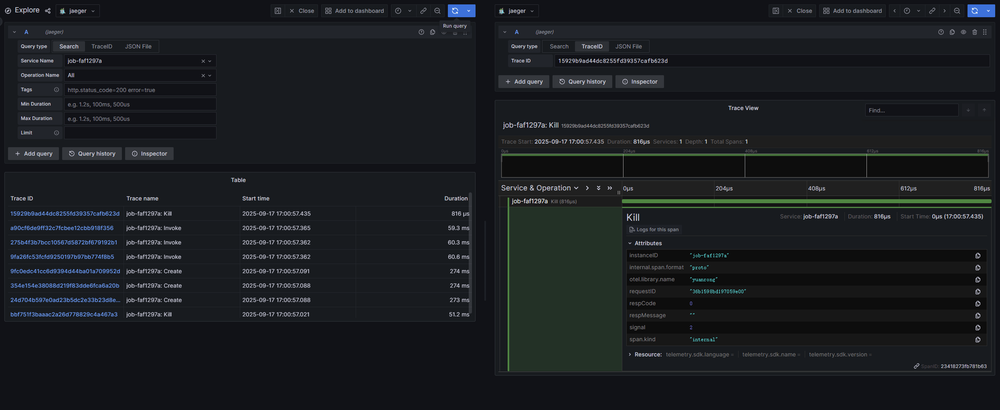

# 链路追踪

链路追踪（Traces）提供了应用程序发出请求时发生情况的全景图，一条链路可以被认为是一个由多个跨度（Span）组成的有向无环图（DAG 图）。openYuanrong 的 Traces 功能基于 [Opentelemetry](https://opentelemetry.io){target="_blank"} 实现。

## 基本概念

Span 可以理解为一次方法调用，一个程序块的调用，或者一次 RPC/数据库访问。只要是一个具有完整时间周期的程序访问，都可以被认为是一个 Span。

- Span Tag：一组键值对构成的 Span 标签集合。键值对中，键必须为字符串，值可以是字符串，布尔，或者数字类型。
- Span Log：一组 Span 的日志集合。 每次 log 操作包含一个键值对，以及一个时间戳。 键值对中，键必须为 string，值可以是任意类型。 但是需要注意，不是所有的支持 OpenTracing 的 Tracer 都需要支持所有的值类型。
- SpanContext：Span 上下文对象。
   - 任何一个 OpenTracing 的实现，都需要将当前调用链的状态（例如：trace 和 span 的 id），依赖一个独特的 Span 去跨进程边界传输。
   - Baggage Items，Trace 的随行数据，是一个键值对集合，它存在于 trace 中，也需要跨进程边界传输。
- References（Span 间关系）：相关的零个或者多个 Span（Span 间通过 SpanContext 建立这种关系）。

Traces 与 Span 的时间轴关系如下：

```text

––|–––––––|–––––––|–––––––|–––––––|–––––––|–––––––|–––––––|–> time

 [Span A···················································]
           [Span B··············································]
              [Span D··········································]
              [Span C········································]
                    [Span E·······]

​             [Span F··]

​                  [Span G··]

​              [Span H··]

```

## 启用 Trace

启用 Trace 需要在部署 openYuanrong 时配置以下参数：

- `enable_trace`: Trace 开启开关。
- `runtime_trace_config`: Trace 数据导出器配置，当前支持 OtlpGrpcExporter 和 LogfileExporter 两种导出器。

### OtlpGrpcExporter 导出器

OtlpGrpcExporter 导出器通过 gRPC 协议，使用 protobuf 序列化格式，按照 OTLP 规范导出数据。使用 OtlpGrpcExporter 导出数据建议提前部署好数据接收及处理后端（otel-collector\jaeger\grafana 等），grafana 部署可参考 Opentelemetry[官方样例](https://opentelemetry.io/zh/docs/demo/architecture/){target="_blank"}。

OtlpGrpcExporter 导出器的初始化参数如下:

| 初始化参数 | 说明                        | 约束 |
| ---------- |---------------------------| ------------------ |
| enable                 | 是否启用 OtlpGrpcExporter 导出器 | 必填 |
| endpoint               | 接收后端地址，格式为 ip:port        | 必填 |

### LogfileExporter 导出器

LogfileExporter 导出器将数据导出到 log 文件中，其初始化参数如下:

| 初始化参数 | 说明                       | 约束 |
| ---------- |--------------------------| ------------------- |
| enable                 | 是否启用 LogfileExporter 导出器 | 必填 |

### 配置示例

#### 主机集群上启用 Trace

配置参考命令如下：

```text

yr start --master --enable_trace true --runtime_trace_config "{\"otlpGrpcExporter\":{\"enable\":true,\"endpoint\":\"192.168.1.2:4317\"},\"logFileExporter\":{\"enable\":true}}"

```

示例启用了 OtlpGrpcExporter 和 LogFileExporter 导出器，Trace 数据将导出到地址为 192.168.1.2:4317 的后端服务和日志文件中。

#### 在 K8s 集群上启用 Trace

修改 helm 包中的 values.yaml 配置文件。

```yaml

observer:
  trace:
    enable: true
    runtimeTraceConfig: "{\"otlpGrpcExporter\":{\"enable\":false,\"endpoint\":\"192.168.1.2:4317\"},\"logFileExporter\":{\"enable\":true}}"

```

示例启用 LogFileExporter 导出器，Trace 数据将导出到日志文件中。

### 查看 Trace 数据

#### 查看 OtlpGrpcExporter 导出器的数据

以 Trace 数据导出到 grafana 后端为例。

1. 登录 grafana 后端。地址为：机器 IP:3000 。
2. 点击左侧边栏的 Explore 页签。
3. 在 Service Name 下拉框中选择目标函数实例，点击右上角的 Run query 按钮即可查询函数实例相关 Trace 数据。

#### 查看 LogFileExporter 导出器的数据

| 部署方式 | 日志路径 |
|------| ------------------------- |
| 主机部署 | 1. job-xxx-driver.log 文件 <br/>2. `/tmp/yr_sessions/latest/log` 目录 |
| K8s 部署 | 1. job-xxx-driver.log 文件 <br/>2. frontend pod、function scheduler pod 及调度函数实例的 agent pod `/home/snuser/log` 目录下的 runtime 日志 |

在日志文件中搜索关键字 `trace info` 即可查找导出的 trace 数据。

:::{Note}

提前设置以下环境变量，`job-xxx-driver.log` 文件中才有导出的 trace 数据。

```bash
export ENABLE_TRACE=true
export RUNTIME_TRACE_CONFIG="{\"otlpGrpcExporter\":{\"enable\":true,\"endpoint\":\"192.168.1.2:4317\"},\"logFileExporter\":{\"enable\":true}}"
```

:::

#### Trace 数据示例

以配置 OtlpGrpcExporter 导出器对接 grafana 为例，无需额外增加代码，openYuanrong 将导出关键流程调用链，执行如下无状态函数。

```python

import yr
yr.init()


@yr.invoke
def add(n):
    return n+1


results = [add.invoke(i) for i in range(3)]
print([yr.get(i) for i in results])

yr.finalize()

```

上报到 grafana 的 Trace 数据如下图：

